# MediCare Cardiac Center - Heart Disease Prediction System

## Premium Medical AI Platform

A sophisticated heart disease prediction system with AI-powered treatment recommendations, featuring an elegant medical interface and AWS cloud deployment.

## GitHub + Amplify Deployment (Recommended)

### Easiest Deployment Method:
1. Push to GitHub - One command
2. Connect Amplify - Two clicks in console
3. Deploy - Automatic deployment

### Step 1: Initialize Git & Push to GitHub
```bash
# Initialize Git repository
git init
git add .
git commit -m "Initial commit - MediCare Cardiac Center"

# Create GitHub repository at: https://github.com/new
git remote add origin https://github.com/yourusername/heart-disease-prediction.git
git push -u origin main
```

### Step 2: Deploy with Amplify Console (Easiest)
1. Go to [AWS Amplify Console](https://console.aws.amazon.com/amplify/)
2. Click "Get started"
3. Choose "GitHub" as the provider
4. Connect your GitHub account
5. Select your repository
6. Build settings will be auto-configured
7. Click "Save and deploy"

### Step 3: Deploy Backend Separately
```bash
# Deploy Lambda + API Gateway
aws lambda create-function --function-name heart-disease-prediction --runtime python3.9 --role arn:aws:iam::YOUR_ACCOUNT_ID:role/lambda-execution-role --handler lambda_function.lambda_handler --zip-file fileb://deployment.zip --region us-east-1 --description "Heart Disease Prediction API" --timeout 30 --memory-size 512

aws apigateway create-rest-api --name "Heart Disease Prediction API" --description "API for Heart Disease Prediction" --region us-east-1
```

### Step 4: Update Frontend API URL
```bash
# Update JavaScript with new API URL
sed -i.bak 's|http://127.0.0.1:5000/predict|https://YOUR_API_ID.execute-api.us-east-1.amazonaws.com/prod/predict|g' static/script.js
```

## Why GitHub + Amplify is Best

### Benefits:
- Zero Configuration: Amplify auto-detects everything
- Automatic Builds: Every push triggers deployment
- Rollback Support: One-click to previous version
- Global CDN: CloudFront included automatically
- SSL Certificates: Free HTTPS certificates
- Custom Domains: Easy domain setup
- Branch Management: Deploy different branches
- Monitoring: Built-in analytics and logging

### Deployment Process:
```
GitHub Push → Amplify Build → CloudFront Deploy → Live URL
```

### What You Get:
- Live URL: `https://your-app.amplifyapp.com`
- Build Logs: Real-time build status
- Deploy History: Version control
- Performance Metrics: Built-in analytics
- Error Tracking: Automatic error reporting

Quick Start Setup

Prerequisites:
1.	Sign-in to AWS or [Create an Account](https://us-west-2.console.aws.amazon.com)
2.	[Create an AWS Bucket](https://docs.aws.amazon.com/AmazonS3/latest/gsg/CreatingABucket.html)
   a.	Note: please make sure your bucket name starts with ‘sagemaker’.  This allows SageMaker to access your bucket.
   b.	Make a note of the region.  Make sure all services used are in the same region as your bucket.
3.	Upload **‘heart.csv’** file located in project **/src/main/resources** directory to your AWS Bucket.  
4.	Upload packaged code **‘heart_function-1.0.0’** provided in root directory to your AWS Bucket.
5. Download **heart-disease-prediction.ipynb** file to your local computer

### Training SageMaker Model
In this section, we will use AWS SageMaker to import the sample jupyter notebook and train a model that can predict heart disease.  Once the model is trained, it will be hosted directly on SageMaker. 

1.	Using AWS Console, select **Amazon SageMaker** from the list of AWS Services.
2.	In SageMaker console, select **Notebook instances** from the left navigation panel

 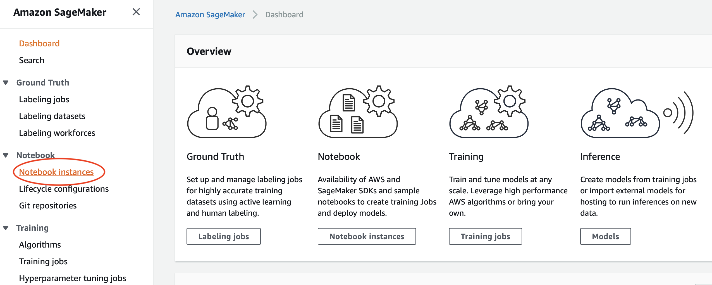

3.	Select create **notebook instance**
4.	Enter a **name** for your notebook.  Keep all other fields as default. 

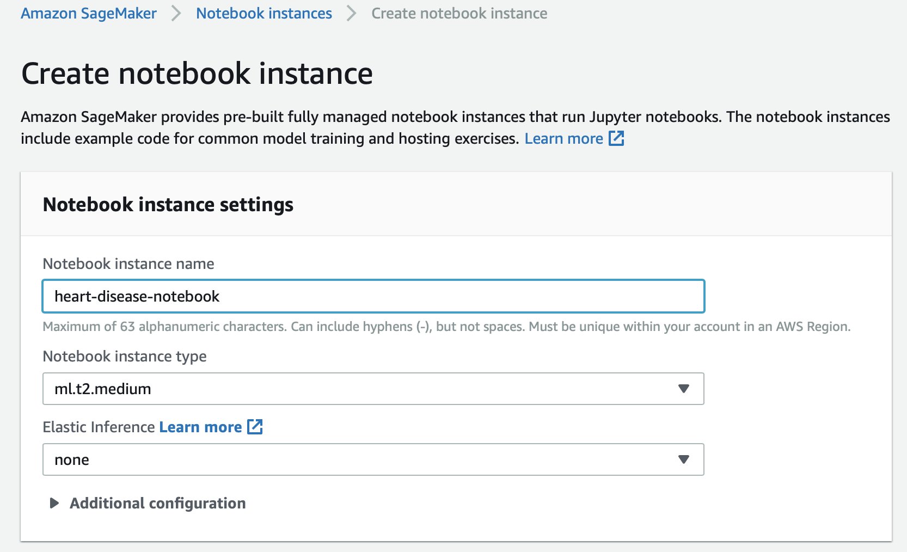

5.	Click on **Create notebook instance**
6.	Once notebook instance is ‘**In Service’**, click on **Open Jupyter.**
7.	Click **Upload**
8.	Choose **heart-disease-prediction.ipynb**
9.	Click on **Upload** again to confirm

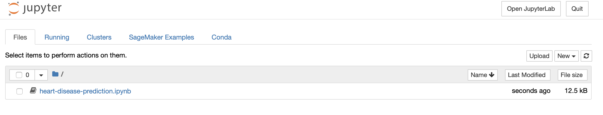

10.	Click on **heart-disease-prediction.ipynb** to open the file
11.	Scroll down to the first section that contains code and enter the **bucket name** that you had created earlier.

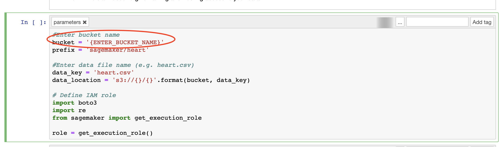

12.	Once the bucket name is replaced, Click **Run**

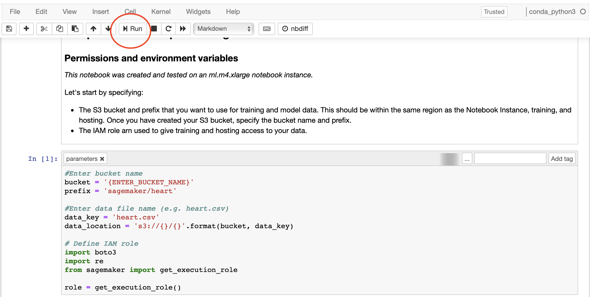

13.	When a cell blocks finishes execution, a number is displayed next to the cell.  **Continue clicking on Run** on each cell block that contains code.  
Note: Training and deploying the model take the longest time.

14.	After you have hosted your model, copy the **endpoint name.**  You will use this endpoint name when launching cloud formation.

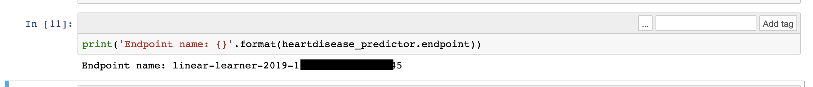

15.	You can continue to execute the remaining cell blocks to get a prediction on SageMaker notebook.  
Warning: Do not execute the ‘(Optional) Delete the endpoint’.

### Launch cloud Formation

In this section, you will launch a cloud formation template that performs the following:
- Creates API Gateway
- Creates a lambda function that calls SageMaker endpoint
- Creates an SNS notification that sends e-mail

1.	Using AWS Console, select **CloudFormation** from the list of AWS Services.
2.	Choose **Create Stack**.  
3.	Select **Template is ready** and **Upload a template file**
4.	Choose **cloud_formation_template.yaml** file located in project root directory.
5.	On the next page, specify stack details
   a.	Choose a **stack name**
   b.	Specify your **bucket name** (this is the bucket you created earlier)
   c.	Specify **Email** address.  This email address is used to send you notification if heart disease is predicted.
   d.	Specify the uploaded **lambda code** (this is the code you uploaded)
   e.	Specify the S**ageMaker endpoint** (this is the endpoint you copied earlier)

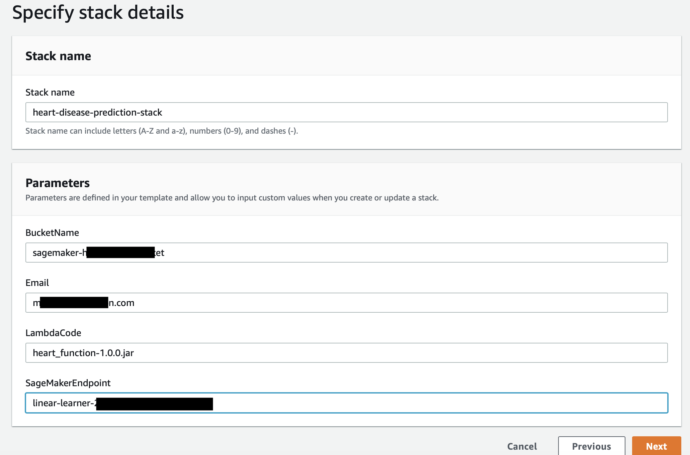

6.	Click **Next**
7.	On subsequent pages, leave all other fields to their **default** values and click **Next.** 
8.	On the final page, acknowledge all **Transform might require access capabilities**
9.	Choose **Create Stack**
10.	Once the Stack is successfully created, click on **Output** tab
11.	Copy the **prodDataEndpoint** value.  This is the API Gateway endpoint used for real time predictions.

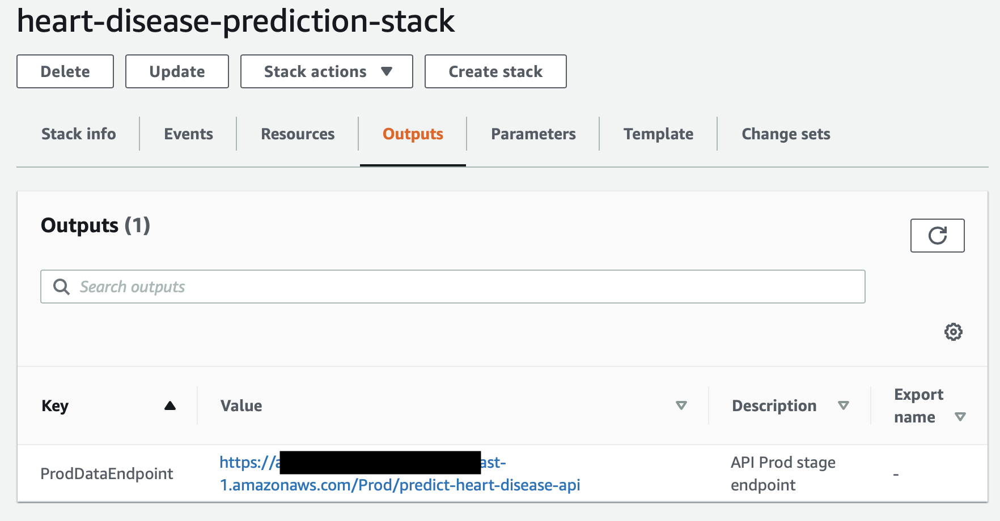


### Predicting Heart disease in real time

The cloud formation template has created an endpoint that can be invoked in real time to predict heart disease.  We will use the sample data below to get a prediction of heart disease.

Example data:
You can use API Gateway console or postman, to invoke your API in real time.  Below sample data to get heart disease prediction in real time.

{"age": "23","sex": 1,"cp": 3,"trestbps": 145,"chol": 233,"fbs": 1,"restecg": 0,"thalach":150,"exang": 0,"oldpeak": 2.3,"slope": 0,"ca": 0,"thal": 1}

The above call should return a real time prediction:

 
 
 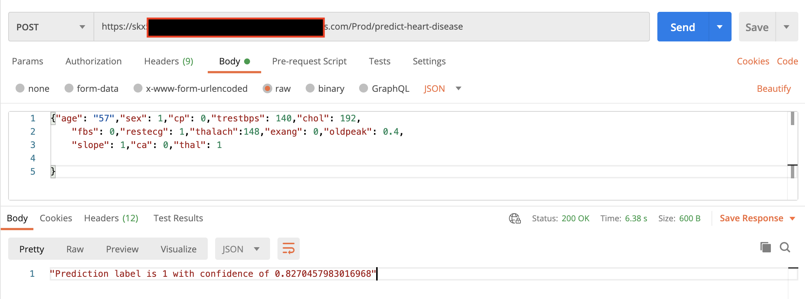


Note: When prediction label is 1, a notification e-mail is also sent.  You may have to first confirm the subscription of your e-mail.

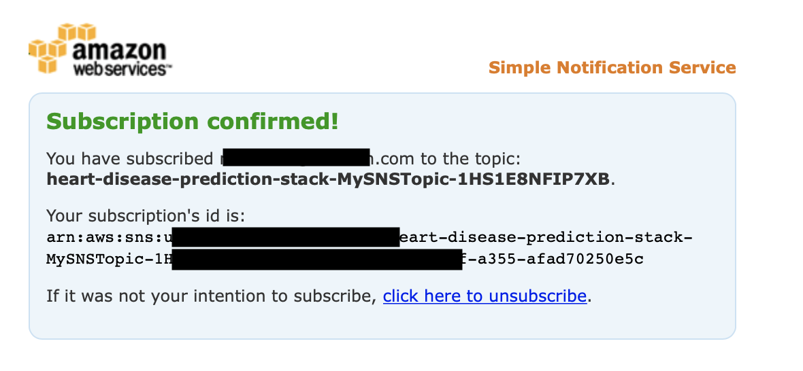

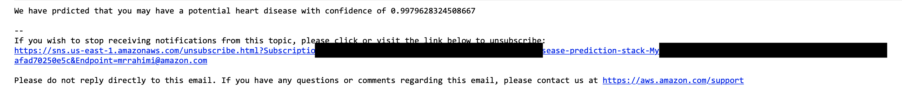


## License

This library is licensed under the MIT-0 License. See the LICENSE file.

